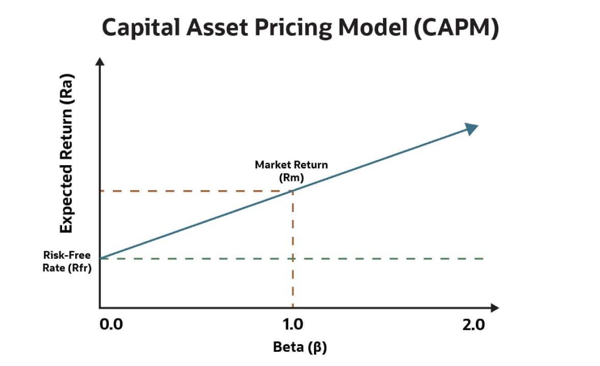

# AI-Powered Quantitative Trading System
## From Beginner to Institutional Quant Researcher

Author: Quant Research Curriculum
Version: 1.0

---

# Table of Contents

## Foundations

1. [Introduction](#introduction)
2. [Financial Market Foundations](#chapter-1-financial-market-foundations)
    - Quantitative Finance
3. [Mathematics for Quantitative Trading](#chapter-2-mathematics-for-quantitative-trading) 
    - Linear Algebra
        - Vectors
        - Matrices
        - Eigenvalues
        - Eigenvectors
        - SVD
        - PCA

        Explain 
        - why it matters in trading:
        - Mathematical derivation
        - Numerical examples
        - Python implementation
    - Calculus
        - Derivatives
        - Partial derivatives
        - Optimization
        - Gradient descent
    
        Explain:
        - Portfolio optimization
        - Risk minimization
        - Model training
    - Probability
        - Random variables
        - Probability distributions
        - Bayes theorem
        - Conditional probability
        - Joint distributions
    
        Provide examples from:
        - Stock returns
        - Volatility
        - Market regimes
    - Statistics
        - Mean
        - Variance
        - Covariance
        - Correlation
        - Hypothesis testing
        - Confidence intervals
        - Regression analysis 

        Show practical examples using stock market data.

    - Stochastic Processes
        - Brownian Motion
        - Random Walk
        - Geometric Brownian Motion
        - Ito's Lemma
        - Stochastic Differential Equations

        Show how these are used in:
        - Option pricing
        - Market simulation
        - Risk modeling


4. [Statistics and Probability](#chapter-3-statistics-and-probability)
5. [Financial Mathematics](#chapter-4-financial-mathematics)
    - Time Value of Money 
        - Discounting
        - Compounding
        - Present value
        - Future value
    - Portfolio Theory
        - Modern Portfolio Theory
        - Efficient Frontier
        - CAPM
        - Beta
        - Sharpe Ratio
        - Sortino Ratio
        - Information Ratio
    
    Derive formulas step-by-step.

    Provide numerical examples.


## Engineering

6. [Data Engineering for Trading](#chapter-5-data-engineering-for-trading)
    - Data collection
    - Data cleaning
    - Feature engineering
    - Feature stores
    - Real-time streaming
    - Data lakes
    - Data warehouses
7. [Trading Strategy Development](#chapter-6-trading-strategy-development)
    - Trend Following
        - SMA
        - EMA
        - MACD
    - Mean Reversion
        - Bollinger Bands
        - Z-score models
    - Momentum
        - Cross-sectional momentum
        - Time-series momentum
    - Statistical Arbitrage
        - Cointegration
        - Pairs trading
        - Kalman Filters
    - Market Making
        - Inventory models
        - Spread capture
    - Factor Investing
        - Value
        - Growth
        - Momentum
        - Quality
        - Low volatility
8. [Machine Learning for Trading](#chapter-7-machine-learning-for-trading)
    - Supervised Learning
        - Linear Regression
        - Logistic Regression
        - Decision Trees
        - Random Forest
        - XGBoost
        - LightGBM

        Provide complete trading examples.
    - Unsupervised Learning
        - K-Means
        - Hierarchical Clustering
        - PCA
        - Autoencoders

        Use cases:
        - Regime detection
        - Asset clustering
9. [Deep Learning for Trading](#chapter-8-deep-learning-for-trading)
10. [Reinforcement Learning](#chapter-9-reinforcement-learning)

    - Markov Decision Processes
    - Q-Learning
    - DQN
    - PPO
    - A3C

    Build an RL trading agent.

    Explain Trading Agent:
    - State space
    - Action space
    - Reward functions
    - Risk-aware rewards
11. [LLM-Powered Trading Systems](#chapter-10-llm-powered-trading-systems)
    - News analysis
    - Earnings call analysis
    - Sentiment analysis
    - SEC filing analysis
    - Research automation

    Build a complete LLM-powered trading research assistant.


## Portfolio & Risk

12. [Portfolio Construction](#chapter-11-portfolio-construction)
13. [Risk Management](#chapter-12-risk-management) <br/>
    Explain:
    - VaR
    - CVaR
    - Maximum drawdown
    - Position sizing
    - Kelly Criterion
    - Exposure limits

14. [Backtesting Engine](#chapter-13-backtesting-engine)
    - Build from scratch:
        - Event-driven architecture
        - Order management system
        - Portfolio engine
        - Execution simulator
        - Slippage model
        - Transaction cost model

## Professional Quant Research

15. [Quant Research Framework](#chapter-14-quant-research-framework)
    - Research Lifecycle
        - Idea generation
        - Data gathering
        - Feature engineering
        - Signal creation
        - Backtesting
        - Validation
        - Deployment

        Explain:
        - Look-ahead bias
        - Survivorship bias
        - Data leakage
        - Overfitting

16. [Institutional System Design](#chapter-15-institutional-system-design)
17. [Production Deployment](#chapter-16-production-deployment)
18. [Building a Complete Quant Fund](#chapter-17-building-a-complete-quant-fund) <br/>
    Create a complete end-to-end project.

    Include:
    - Data pipeline
    - Feature engineering
    - Alpha generation
    - ML model
    - Risk engine
    - Portfolio optimizer
    - Execution engine
    - Monitoring system

## Career Preparation
19. [Quant Interview Preparation](#chapter-18-quant-interview-preparation)
20. [12-Month Roadmap](#chapter-19-12-month-roadmap)

---

# Recommended Books
- Algorithmic Trading: Winning Strategies and Their Rationale by Ernie Chan (Wiley - 2013)
- Advances in Financial Machine Learning by Marcos López de Prado (Wiley - 2018)
- Trading and Exchanges by Larry Harris ()
- Quantitative Trading by Ernest P. Chan (Wiley - 2009)
- Machine Trading

---

# Chapter 1: Financial Market Foundations

## Learning Objectives

Start with beginner-friendly explanations.

Explain:
- Understand how markets work
- How exchanges work
- Learn order books
- Market participants
- Institutional trading
- Market microstructure
- Understand liquidity
- Alpha generation
- Capital Asset Pricing Model
- Quantitative trading
- High-frequency trading
- Statistical arbitrage
- Algorithmic trading

For every concept:
- Intuition
- Mathematical formulation
- Real-world example
- Python implementation
- Industry use case
---

## 1.1 What is a Stock Market?

### Intuition

Imagine a pizza divided into 1,000 slices.

Company = Pizza

Share = Slice

Buying 10 shares means owning 10 slices.


## Market Capitalization:

Market Cap = Share Price × Shares Outstanding

### Example

```
Apple:

Price = $200

Shares Outstanding = 15 Billion

Market Cap = $3 Trillion
```

### Python Example

```python
price = $200
shares = 1 billion

market_cap = price * shares
print(market_cap)
```

Industry Usage

Used by:
- Portfolio Managers
- Asset Managers
- ETF Providers

---

## 1.2 Exchanges
Major Exchanges
- NYSE
- NASDAQ
- NSE
- BSE

### Example
Suppose:
```
Buyer wants:
100 shares @ $100

Seller wants:
100 shares @ $100
```
Exchange matches them instantly. <br/>
Trade executed.


## Matching Engine
Buyer Order
- → Exchange
- → Seller Order

## 1.3 Order Book
Every exchange maintains an order book.
```
SELL SIDE

101  500 shares
100  300 shares

----------------

99   400 shares
98   600 shares

BUY SIDE
```

### Best Bid
Highest buy price
```
99
```

### Best Ask
Lowest sell price
```
100
```

### Bid-Ask Spread
Spread=Ask−Bid

Example:
```
100 - 99 = 1
```
Spread is one of the major sources of market-making profits.

---

## 1.4 Market Participants

### Retail Traders

Example of small investors
```
You
Me
Robinhood users
Zerodha users
```

### Institutional Investors
```
BlackRock
Vanguard
Fidelity Investments
```
Manage billions/trillions.

### Hedge Funds
```
Renaissance Technologies
Citadel
Two Sigma
D. E. Shaw & Co.
```

Objective:
```
Generate Alpha
```

---

## 1.4. Alpha generation
> In investing and portfolio management, alpha (α) is the portion of an investment's return that exceeds (or falls short of) the return of a chosen benchmark after accounting for market exposure.

Alpha = excess return beyond benchmark.

The basic formula is:  $\alpha = R_p - R_b$

Where:
- $R_p$ = portfolio return 
- $R_b$ = benchmark return  
- $\alpha$ = alpha (excess return)
	
	​
### Interpretation
- **Positive alpha** (α>0): The portfolio outperformed the benchmark.
- **Negative alpha** (α<0): The portfolio underperformed the benchmark.
- **Zero alpha** (α=0): The portfolio matched the benchmark.
	​
### Example: 
Suppose:
- Portfolio return = 12%
- Benchmark return = 9%

Then:
```
α=12%−9%=3%
```
The portfolio generated **3% alpha**, meaning it earned 3 percentage points more than the benchmark.

### What is "Alpha Generation"?

**Alpha generation** is the process of creating positive alpha—earning returns above the benchmark through investment skill rather than simply benefiting from overall market movements.

- Common sources of alpha generation include:
- Superior stock selection
- Market timing
- Identifying mispriced securities
- Quantitative trading strategies
- Arbitrage opportunities
- Better risk management

For example, if a fund manager consistently beats the benchmark index through research and stock picking, they are said to be **generating alpha**.

### More Advanced Definition
In modern portfolio theory, alpha is often measured relative to a risk model such as the [Capital Asset Pricing Model](#capital-asset-pricing-model). In that setting, alpha is the return that remains after accounting for the portfolio's exposure to market risk (beta), making it a measure of manager skill rather than simple outperformance.

---

## Capital Asset Pricing Model

The **Capital Asset Pricing Model (CAPM)** is a foundational theory in finance that explains how risk affects the expected return of an investment. Developed in the 1960s by **William F. Sharpe, John Lintner, and Jan Mossin**, it remains a cornerstone of modern portfolio theory and corporate finance. CAPM quantifies the trade-off between systematic risk and expected return, helping investors and firms assess the fair value of risky assets.

### Key Facts
- **Formula**: E(Ri) = Rf + βi × (E(Rm) – Rf)
- **Core Variable**: Beta (β), measuring an asset’s sensitivity to market movements
- **Developed**: Early 1960s
- **Primary Uses**: Asset valuation, portfolio optimization, and cost of equity estimation
- **Foundations**: Builds on Modern Portfolio Theory by Harry Markowitz

### Core Principles

CAPM assumes investors are rational and risk-averse, operating in efficient markets with access to a risk-free asset (such as government bonds). It separates total investment risk into **systematic risk**, which cannot be diversified away and is captured by beta, and **unsystematic risk**, which diversification can eliminate. The model posits that only systematic risk commands a return premium.

### Applications
CAPM informs key areas of financial decision-making:
- **Valuation**: Estimating expected returns for pricing securities
- **Corporate Finance**: Calculating a company’s cost of equity for capital budgeting
- **Portfolio Management**: Assessing performance relative to market risk
- **Investment Strategy**: Comparing risk-adjusted returns across assets


---

## Quantitative trading
Traditional trader:
```
Reads charts
Uses intuition
```

Quant trader:
```
Uses mathematics
Uses statistics
Uses models
Uses algorithms
```

## Market Microstructure

One of the most important topics in institutional trading.

Studies:
```
Order books
Liquidity
Execution
Slippage
Price formation
```

### Example
You want:
```
Buy 1 million shares
```
But only:
```
10,000 shares available
```
Price rises while buying.

This is:
```
Market Impact
```
Understanding this is critical.

---

## Algorithmic Trading
Computer automatically:
```
Reads market
Makes decisions
Places orders
```

Examples:
```python
if sma_20 > sma_50:
    buy()
else:
    sell()
```

---

## High Frequency Trading (HFT)
Time scale:
```
Milliseconds
Microseconds
Nanoseconds
```

Firms:
```
Jane Street
Hudson River Trading
Jump Trading
```

---

## Statistical Arbitrage
Core idea:
```
Temporary mispricing
```
Example:
```
Two airline stocks usually move together.
```
Today:
```
Airline A rises 5%
Airline B unchanged
```
Strategy:
```
Short A
Long B
```
Bet:
```
Spread converges
```
This is called:
```
Pairs Trading
```

### Mathematical View
Spread:

$S_t = P_{A,t} - \beta P_{B,t}$
​

If spread deviates significantly:

---

## Institutional Quant Workflow
```
Market Data
      ↓
Feature Engineering
      ↓
Alpha Signals
      ↓
ML Models
      ↓
Portfolio Construction
      ↓
Risk Controls
      ↓
Execution Engine
      ↓
Broker
      ↓
Exchange
```

## Python Example: First Trading Signal
```python
import pandas as pd

df["sma20"] = df["close"].rolling(20).mean()
df["sma50"] = df["close"].rolling(50).mean()

df["signal"] = (
    df["sma20"] > df["sma50"]
).astype(int)
```
Signal:
```
1 = Buy
0 = Sell
```